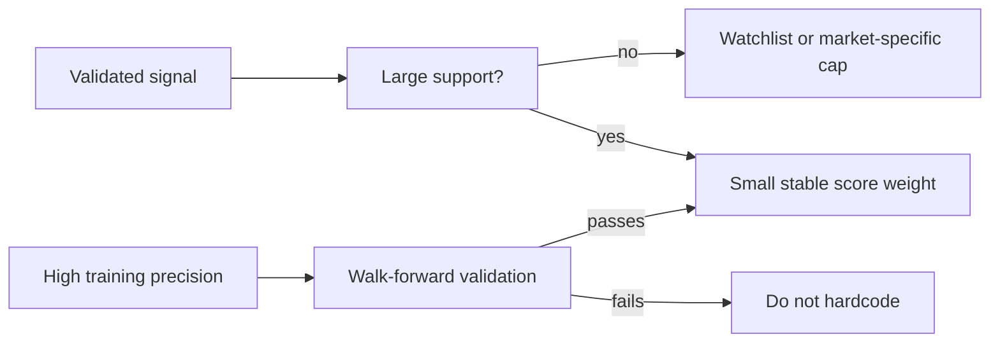

# DBBoss Deep Historical Analysis

Generated: 2026-07-01

## Scope And Data Hygiene

- Source: live trusted `dpbossss.boston/panel-chart-record/*.php` scrape through the app scraper.
- Markets analyzed: 12 listed markets, not 11. The prompt says 11, but the supplied market list includes 12: Sridevi, Time Bazar, Madhur Day, Milan Day, Rajdhani Day, Kalyan, Sridevi Night, Kalyan Night, Madhur Night, Milan Night, Rajdhani Night, Main Bazar.
- Strict cutoff applied after scraping: `isoDate >= 2024-07-01`.
- Effective date range: 2024-07-01 to 2026-06-28.
- Records: 7,263 daily market records. Panels: 14,526 open/close panels.
- Overall DP rate: 24.9%. TP rate: 0.2%.
- Latest completed source rows are not all July 1, 2026. Today's prediction section uses the latest available completed records before 2026-07-01.

Random baselines used:

- Panel top-3: 3 / 220 = 1.36%.
- Panel top-10: 10 / 220 = 4.55%.
- Panel top-30: 30 / 220 = 13.64%.
- Sutta top-3: 30%.
- Sutta top-10/top-30: 100% theoretical if all 10 suttas appear in pick set; in practice duplicate suttas reduce coverage.

## Last 30-Day Current Engine Audit

Walk-forward setup: for each tested date, train on prior records only, with all training records filtered to `>= 2024-07-01`.

| target | n | panel@3 | panel@10 | panel@30 | sutta@3 | sutta@10 | sutta@30 | kind acc | actual DP | avg actual rank |
| --- | ---: | ---: | ---: | ---: | ---: | ---: | ---: | ---: | ---: | ---: |
| Open | 323 | 1.2% | 3.1% | 13.9% | 15.8% | 51.1% | 94.4% | 58.2% | 28.5% | 15.7 |
| Close | 323 | 1.9% | 5.6% | 19.5% | 24.5% | 45.5% | 95.7% | 67.8% | 22.9% | 16.5 |
| Jodi-adjusted close | 323 | 1.5% | 5.9% | 19.5% | 21.7% | 41.5% | 94.1% | 67.8% | 22.9% | 15.8 |

Bettor view:

- Top-10 open panel win rate is 3.1%, below random top-10 baseline 4.55%.
- Top-10 close panel win rate is 5.6%, modestly above baseline.
- Jodi-adjusted top-10 close is 5.9%, modestly above baseline and slightly better than close-only.
- Top-30 close is the strongest current engine result: 19.5% vs 13.64% random, lift +5.86 points.
- The engine is much stronger at broad sutta coverage than exact panel selection. This is not enough by itself for profitable panel betting unless payout/coverage economics support many picks.

Compared with `backtest_reports/2026-06-28/sp-dp-pattern-research.md`:

- The old report found all-time panel base DP rate 24.4%; strict 2-year data is 24.9%.
- The old report found no walk-forward DP rules survived; the fresh 2-year rerun confirms this. One candidate rule passed support but validated at only 25.0%, which is baseline.
- The old report's clean close digit result was 30.3% DP. Fresh strict validation is 29.3% DP on validation support 468, baseline 23.8%, lift +5.5.

## DP Frequency, Trends, And Droughts

Highest last-30 DP rates:

| market | side | 2yr DP | last30 DP | last30 count | first half | second half | current gap | p90 gap |
| --- | --- | ---: | ---: | ---: | ---: | ---: | ---: | ---: |
| Madhur Day | open | 31.1% | 46.7% | 14/30 | 31.5% | 30.6% | 2 | 6 |
| Sridevi | close | 21.1% | 36.7% | 11/30 | 18.5% | 23.6% | 3 | 10 |
| Kalyan | open | 23.3% | 36.0% | 9/25 | 23.4% | 23.3% | 1 | 9 |
| Time Bazar | close | 29.1% | 32.0% | 8/25 | 31.8% | 26.3% | 2 | 6 |
| Milan Day | open | 26.1% | 32.0% | 8/25 | 25.5% | 26.7% | 3 | 7 |
| Rajdhani Day | open | 26.7% | 32.0% | 8/25 | 26.1% | 27.2% | 0 | 6 |

Lowest last-30 DP rates:

| market | side | 2yr DP | last30 DP | current gap | p90 gap | overdue |
| --- | --- | ---: | ---: | ---: | ---: | --- |
| Sridevi Night | close | 20.4% | 13.3% | 3 | 10 | no |
| Main Bazar | close | 27.1% | 15.0% | 11 | 6 | yes |
| Milan Night | close | 20.2% | 16.0% | 1 | 11 | no |

Daily clustering in the last 30 calendar days:

- 30 calendar days analyzed.
- Pure SP days: 3.
- Hot days with 4+ DPs: 21.
- DP count distribution: 0:3, 1:2, 2:1, 3:3, 4:4, 5:2, 6:5, 7:3, 8:2, 9:2, 10:2, 12:1.

Trend read:

- No broad monotonic 2-year DP shift survives across all markets.
- Notable second-half increases: Milan Night open +6.4 points, Sridevi close +5.1, Rajdhani Night close +4.5, Kalyan Night open +3.9.
- Notable second-half decreases: Time Bazar close -5.5, Madhur Night close -4.5, Milan Night close -4.0, Madhur Day close -3.5.
- Only current p90+ DP drought: Main Bazar close, current gap 11 vs p90 6. Treat as alert, but validation showed drought-overdue was not predictive by itself.

## Pattern Mining Results

### Validated Or Usable Signals

| pattern | train support | train precision | val support | val precision | val baseline | validation lift | recommendation |
| --- | ---: | ---: | ---: | ---: | ---: | ---: | --- |
| Open OOO then close EEE | 91 | 52.7% | 15 | 53.3% | 23.8% | +29.5 | Add cautiously; strong but low support |
| Close clean of open first/last | 3,215 | 30.1% | 468 | 29.3% | 23.8% | +5.5 | Keep, but reduce from +18 to +10/+12 |
| Close shares open middle digit | 1,684 | 16.0% | 221 | 19.9% | 23.8% | -3.9 | Add mild DP suppression |
| Kalyan after prev close dpDigit=8 | 16 | 50.0% | 4 | 75.0% | 20.1% | +54.9 | Already present; support too tiny to raise |
| Wednesday Rajdhani Night close | 88 | 31.8% | 13 | 46.2% | 23.4% | +22.8 | Watchlist only; support 13 |

### Failed Or Weak Ideas

- First-week Saturday copying last month's first-week Saturday: 80 previous-DP cases, 20.0% hit vs 21.1% base. Do not implement.
- Same weekday and same week-of-month monthly echo: 3,093 previous-DP cases, 24.4% hit vs 24.8% base. Do not implement.
- Earlier same-day open DP count = 0: validation 25.6% vs 26.0% base. Current dry-day cascade should be weakened or made conditional.
- Source popular sequence/triple premise: validation lift only +1.4 points for popular-panel hits. Not useful as coded.
- Digit temperature last 30 days: hottest digit 5 had z=+1.56; coldest 2 and 3 had z=-1.28. None reaches normal significance.
- Cross-market open DP correlations were tiny. Largest absolute correlation: Milan Day vs Milan Night r=+0.131. Most are not actionable.
- Panel echo through liquidity source within 2 days: 2.0% hit over 13,734 source panels. Do not use as a boost.
- Jodi reversal within 7 days: 6.4%. No edge found.

### Weekday And Calendar

For Wednesday, July 1, 2026, 2-year Wednesday DP rates:

| market | combined DP | open DP | close DP |
| --- | ---: | ---: | ---: |
| Rajdhani Night | 30.2% | 26.7% | 33.7% |
| Main Bazar | 29.5% | 29.0% | 30.0% |
| Madhur Night | 28.2% | 34.7% | 21.8% |
| Milan Day | 27.5% | 23.0% | 32.0% |
| Madhur Day | 27.2% | 25.7% | 28.7% |
| Kalyan Night | 26.0% | 31.0% | 21.0% |

Calendar effects:

- Sunday remains suppressed: 15.8% DP over 608 panels.
- Monday is highest weekday: 28.2% over 2,412 panels.
- First week vs last week is nearly flat: 25.1% vs 25.5%.
- Top day-of-month DP rates: 29th 29.8%, 4th 29.3%, 21st 28.1%, 14th 27.6%, 24th 27.6%. These are descriptive only; no walk-forward lift proven.

### Even/Odd And Digit Carry

All-even/all-odd by weekday:

| weekday | n | all-even | all-odd | DP rate |
| --- | ---: | ---: | ---: | ---: |
| Monday | 2,412 | 12.5% | 12.4% | 28.2% |
| Tuesday | 2,436 | 12.3% | 11.0% | 26.8% |
| Wednesday | 2,422 | 12.3% | 11.8% | 25.6% |
| Sunday | 608 | 9.0% | 10.2% | 15.8% |

Open-to-close composition patterns with n >= 50:

| transition | n | close DP |
| --- | ---: | ---: |
| OOO -> EEE | 106 | 52.8% |
| EEE -> EEE | 102 | 48.0% |
| 2E1O -> OOO | 309 | 47.2% |
| 1E2O -> EEE | 329 | 46.5% |

Last-30 digit carry:

| condition | n | close DP | 95% CI |
| --- | ---: | ---: | --- |
| close shares neither open first nor last | 153 | 25.5% | 19.2-32.9 |
| close shares both open first and last | 8 | 0.0% | 0.0-32.4 |
| close shares open middle | 68 | 19.1% | 11.5-30.0 |
| close does not share open middle | 229 | 24.0% | 18.9-30.0 |

## Sutta And Markov Analysis

Open-to-close Markov matrix best close sutta per open sutta:

| open sutta | best close | n | probability |
| ---: | ---: | ---: | ---: |
| 0 | 4 | 759 | 11.9% |
| 1 | 3 | 722 | 13.0% |
| 2 | 1 | 731 | 13.4% |
| 3 | 8 | 697 | 11.2% |
| 4 | 0 | 740 | 11.5% |
| 5 | 1 | 716 | 11.6% |
| 6 | 0 | 743 | 11.4% |
| 7 | 7 | 710 | 11.8% |
| 8 | 2 | 733 | 13.0% |
| 9 | 7 | 712 | 11.8% |

Day-over-day close-to-next-open best transitions:

| prev close | best next open | n | probability |
| ---: | ---: | ---: | ---: |
| 0 | 9 | 750 | 12.3% |
| 1 | 0 | 794 | 11.7% |
| 2 | 0 | 747 | 11.6% |
| 3 | 0 | 724 | 11.5% |
| 4 | 4 | 719 | 11.7% |
| 8 | 2 | 702 | 13.0% |

Interpretation:

- The Markov chain is irreducible in observed data and has a stationary distribution close to uniform.
- Best conditional sutta probabilities are only 11.2% to 13.4%, so hardcoding full transition matrices will mostly add noise.
- Use only as a very small sutta tie-breaker, not a main rank driver.

Lowest sutta entropy, where uniform max is log2(10) = 3.322:

| market | side | n | entropy |
| --- | --- | ---: | ---: |
| Sridevi | open | 722 | 3.302 |
| Rajdhani Night | open | 503 | 3.302 |
| Time Bazar | open | 602 | 3.304 |
| Rajdhani Day | close | 604 | 3.304 |
| Madhur Day | close | 702 | 3.306 |

Autocorrelation:

- Strongest absolute sutta autocorrelation found: Kalyan close lag-14 r=+0.104.
- All top lag correlations are around abs(r) <= 0.104. This is too weak for a main signal.

## Operator Profiles

Examples of 2-year frequent/avoided panels:

| market | expected per panel | frequent panels | avoided panels |
| --- | ---: | --- | --- |
| Sridevi | 6.6 | 157:18, 168:16, 348:16, 458:16, 468:15 | 550:0, 333:0, 110:0, 220:0, 699:0 |
| Madhur Day | 6.4 | 170:15, 460:15, 136:14, 389:14, 168:13 | 555:0, 999:0, 122:0, 222:0, 888:0 |
| Rajdhani Day | 5.5 | 570:18, 380:15, 357:14, 190:13, 235:13 | 244:0, 788:0, 255:0, 366:0, 689:0 |
| Kalyan | 5.5 | 138:16, 578:16, 348:14, 678:14, 125:13 | 466:0, 799:0, 440:0, 499:0, 166:0 |
| Main Bazar | 4.6 | 269:14, 579:12, 190:11, 457:11, 670:11 | 489:0, 660:0, 567:0, 788:0, 440:0 |

Use these only as calibration priors with shrinkage. A zero count in two years is informative, but many avoided panels are triples or structurally unpopular combinations.

## Recommended Code-Level Changes

No source code was edited. Recommended changes:

1. `jodi.ts`: reduce `applyOpenPanelCleanFilter` no-share bonus from `+18` to `+10` or `+12`.
   - Evidence: validation 29.3% DP vs 23.8% base, lift +5.5 over n=468.
   - Current +18 is probably too large for the observed lift.

2. `jodi.ts`: add middle-digit carry DP suppression.
   - Formula: if `closePanel.includes(openPanel[1])`, apply `-6` to DP-focused close picks or multiply close DP bias by `0.88`.
   - Evidence: validation 19.9% DP vs 23.8% base, lift -3.9 over n=221.

3. `jodi.ts` or `dp-kind-context.ts`: add close composition signal after known open:
   - If `openComposition === OOO && closeComposition === EEE`, add DP score `+14` to EEE close DP panels only.
   - Evidence: validation 8/15 = 53.3% vs 23.8% base. Low support, so cap the boost.

4. `dp-kind-context.ts`: weaken dry-day cascade.
   - Current earlier-open-DP-count-0 logic does not validate: 25.6% vs 26.0% base.
   - Recommended: remove broad `0 earlier DPs -> x0.84` suppression, or apply only Sunday-specific suppression.

5. `dp-kind-context.ts`: do not raise current Kalyan digit-8 rule despite good recent validation.
   - Evidence is only validation support 4. Keep at `x1.30`, cap total `dpBias` near current behavior.

6. `scoring.ts`: avoid hardcoding full Markov matrices as primary boosts.
   - Best conditional probabilities are only 11.2%-13.4%.
   - If used, formula should be tiny: `suttaTransitionBoost = clamp((P - 0.10) / 0.03, -1, 1) * 3`.

7. `scoring.ts`: add shrinkage operator profile prior only after validation.
   - Formula: `panelProfileBoost = clamp((observed - expected) / sqrt(expected), -2, 2) * 2`.
   - Do not apply to panels with `expected < 4.5` without heavier shrinkage.

## Ranked Top Discoveries

| rank | discovery | evidence | validation | action |
| ---: | --- | --- | --- | --- |
| 1 | OOO open to EEE close DP | train 48/91, val 8/15 | +29.5 lift | small close DP boost |
| 2 | clean close first/last | val 137/468 | +5.5 lift | keep, lower weight |
| 3 | middle digit carry suppresses close DP | val 44/221 | -3.9 lift | add mild suppression |
| 4 | Main Bazar close p90 drought | gap 11 vs p90 6 | drought rule failed | alert only |
| 5 | Wednesday Rajdhani Night close | val 6/13 | +22.8, tiny n | watchlist |
| 6 | Kalyan prev close digit-8 | val 3/4 | tiny n | keep existing only |
| 7 | day Markov transitions | best 13.4% | weak | tie-break only |
| 8 | operator profile favorites | top panels 2-3x expected | not walk-forwarded | shrinkage only |
| 9 | same weekday/month echo | 24.4% vs 24.8% | failed | do not add |
| 10 | cross-market DP correlation | max abs r=0.131 | weak | do not add |

## July 1, 2026 Predictions

These are model recommendations using latest completed data before 2026-07-01. They are not guarantees.

| market | last row | open kind | close kind | open top 5 | close top 5 | target suttas | avoid suttas |
| --- | --- | --- | --- | --- | --- | --- | --- |
| Sridevi | 2026-06-28 | SP 76.2 | SP 77.2 | 234, 345, 456, 567, 890 | 135, 136, 190, 234, 280 | 9,2,5,8 | 0 gap19, 9 gap18, 3 gap13 |
| Time Bazar | 2026-06-27 | SP 76.2 | SP 77.2 | 150, 367, 466, 330, 349 | 156, 179, 223, 250, 480 | 6,9,3,2 | 2 gap25, 7 gap21, 5 gap12 |
| Madhur Day | 2026-06-28 | SP 76.2 | SP 77.2 | 113, 136, 145, 146, 148 | 112, 266, 356, 490, 580 | 5,0,1,3 | 3 gap27, 4 gap17, 7 gap9 |
| Milan Day | 2026-06-27 | SP 76.2 | SP 77.2 | 137, 236, 245, 489, 290 | 159, 249, 258, 360, 450 | 1,4,3,5 | 5 gap24, 9 gap18, 6 gap8 |
| Rajdhani Day | 2026-06-27 | SP 76.2 | SP 77.2 | 237, 499, 140, 249, 357 | 170, 440, 125, 178, 247 | 2,5,1,0 | 8 gap27, 6 gap15, 1 gap14 |
| Kalyan | 2026-06-27 | SP 76.2 | SP 77.2 | 124, 136, 137, 139, 144 | 126, 135, 168, 190, 339 | 7,0,1,3 | 9 gap35, 5 gap15, 0 gap11 |
| Sridevi Night | 2026-06-28 | SP 74.6 | SP 76.6 | 400, 117, 127, 128, 145 | 238, 490, 580, 235, 237 | 4,9,0,1 | 1 gap15, 3 gap9, 7 gap7 |
| Kalyan Night | 2026-06-23 | SP 74.6 | SP 76.6 | 345, 567, 890, 334, 460 | 345, 348, 357, 456, 567 | 2,8,7,0 | 7 gap66, 3 gap18, 5 gap17 |
| Madhur Night | 2026-06-27 | DP 35.5 | DP 32.8 | 123, 234, 678, 789, 345 | 123, 169, 234, 330, 345 | 6,9,1,4 | 6 gap25, 0 gap13, 2 gap12 |
| Milan Night | 2026-06-27 | SP 74.6 | SP 76.6 | 118, 136, 190, 235, 244 | 246, 240, 268, 349, 358 | 0,8,1,9 | 2 gap17, 6 gap12, 3 gap8 |
| Rajdhani Night | 2026-06-26 | SP 74.6 | SP 76.6 | 190, 370, 560, 578, 122 | 133, 178, 233, 259, 250 | 0,1,5,2 | 8 gap15, 7 gap13, 6 gap12 |
| Main Bazar | 2026-06-26 | SP 74.6 | SP 76.6 | 114, 123, 169, 234, 259 | 234, 345, 678, 123, 147 | 6,9,5,7 | 2 gap12, 1 gap9, 4 gap8 |

Special alert:

- Madhur Night is the only model DP-kind call for both open and close. Confidence is low in absolute terms, because estimated DP rate is 35.5% open and 32.8% close.
- Main Bazar close is overdue by p90 gap, but drought-overdue did not validate. Treat as watchlist, not a DP guarantee.
