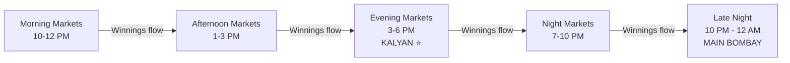

# 🎲 How Satta Matka Actually Works — Complete Deep Analysis

## 1. Origin & Fundamental Nature

Satta Matka ("Satta" = betting, "Matka" = earthen pot) is an **Indian number-betting game** that originated in the 1960s. Originally, players wrote numbers 0-9 on slips and drew them from an earthen pot. In its modern form, it is a fully digitized numbers game run by **operators** (the "house") across dozens of parallel markets, with results published on portals like `dpbosss.net.in`.

> **Critical insight:** This is NOT a random lottery. It is a **parimutuel betting market** where the operator (house) selects the result that minimizes their own payout liability. The result is algorithmically chosen to maximize house profit.

---

## 2. The Anatomy of a Single Draw

Every market conducts **one draw per day**, which actually consists of **two sub-draws** separated by a time gap:

### The Two-Phase Structure:
```
┌─────────────────────────────────────────────────────────┐
│   OPEN DRAW (e.g. 3:45 PM for Kalyan)                  │
│   → Three digits are drawn: e.g. 3, 6, 8               │
│   → These form the OPEN PANEL (Panna/Patti): 368       │
│   → The SUM of digits mod 10 = the OPEN SUTTA:         │
│     (3+6+8) = 17 → 7                                   │
│                                                         │
│   Result so far:  368 - 7                               │
├─────────────────────────────────────────────────────────┤
│   CLOSE DRAW (e.g. 5:45 PM for Kalyan)                 │
│   → Three more digits: e.g. 2, 7, 9                    │
│   → CLOSE PANEL: 279                                   │
│   → CLOSE SUTTA: (2+7+9) = 18 → 8                     │
│                                                         │
│   Result so far:  368 - 78 - 279                       │
│                    ↑     ↑    ↑                         │
│                 Open   Jodi  Close                      │
│                 Panel        Panel                      │
└─────────────────────────────────────────────────────────┘
```

### The Final Result Format:
A complete result looks like: **`368-78-279`**
- `368` = **Open Panel** (Open Panna/Patti) — 3-digit combination
- `78` = **Jodi** — the two Suttas combined (Open Sutta + Close Sutta)
- `279` = **Close Panel** (Close Panna/Patti) — 3-digit combination

This is confirmed by the scraped `current_results` data:
```json
{ "market": "Kalyan", "current_result": "368-78-279" }
{ "market": "Milan Day", "current_result": "245-10-479" }
{ "market": "Sridevi", "current_result": "340-73-779" }
```

---

## 3. The Betting Products (What Players Bet On)

Players can bet on multiple products within each draw:

| Bet Type | What It Is | Example | Payout Ratio |
|----------|-----------|---------|-------------|
| **Sutta (Ank)** | A single digit (0-9), either the Open or Close Sutta | "Open will be 7" | ~9:1 |
| **Jodi** | The 2-digit Open+Close Sutta combination | "Jodi will be 78" | ~90:1 |
| **Panel (Panna/Patti)** | The exact 3-digit combination (Open or Close) | "Open panel will be 368" | ~140:1 to ~900:1 |
| **SP (Single Panna)** | Panel with ALL DIFFERENT digits (e.g. 368) | 120 unique SP panels | ~140:1 |
| **DP (Double Panna)** | Panel with EXACTLY TWO same digits (e.g. 338) | 90 unique DP panels | ~280:1 |
| **TP (Triple Panna)** | Panel with ALL THREE same digits (e.g. 333) | 10 unique TP panels | ~900:1 |

### Panel Classification:
- **SP (Single Panel):** All 3 digits are different → 120 possible (e.g., 123, 259, 468)
- **DP (Double Panel):** Exactly 2 digits are the same → 90 possible (e.g., 112, 338, 550)
- **TP (Triple Panel):** All 3 digits are the same → 10 possible (000, 111, 222...999)
- **Total unique panels:** 220

### The Panel Universe (all 220):
The scraper/predictor generates them using a nested loop where i ≤ j ≤ k across digits [1,2,3,4,5,6,7,8,9,0] (0 is treated as the "highest" position, coming after 9):
```
for i in 0..9:
  for j in i..9:
    for k in j..9:
      panels.push(digits[i] + digits[j] + digits[k])
```

### The Sutta
The **Sutta** is the single-digit "summary" of a panel:
```
Panel: 368 → (3+6+8) = 17 → Last digit = 7 → Sutta = 7
Panel: 479 → (4+7+9) = 20 → Last digit = 0 → Sutta = 0
```

Each Sutta (0-9) maps to a specific set of panels. Knowing the Sutta narrows down from 220 panels to ~22 panels.

---

## 4. The Market Ecosystem — A Day in the Life

The scraped data from `dpbosss.net.in` reveals **35+ parallel markets** running from morning to late night. Each market has:
- A fixed daily schedule (Open time → Close time)
- Its own panel chart (historical data going back years)
- Its own betting pool/liquidity

### Daily Market Schedule (chronological):

| Time | Markets |
|------|---------|
| **10:00 - 11:00 AM** | Karnataka Day |
| **10:15 - 11:15 AM** | Milan Morning |
| **10:35 - 11:35 AM** | Goa Morning |
| **11:10 - 12:10 PM** | Time Bazar Morning |
| **11:30 - 12:30 PM** | Madhur Morning |
| **11:30 - 12:40 PM** | Super Sridevi |
| **11:35 - 12:35 PM** | Sridevi |
| **11:45 - 12:45 PM** | Madhuri |
| **11:55 - 12:55 PM** | Kalyan Morning |
| **12:45 - 02:45 PM** | Mumbai Mail |
| **01:10 - 02:10 PM** | Time Bazar |
| **01:30 - 02:30 PM** | Madhur Day, Tara Mumbai Day |
| **03:05 - 05:05 PM** | Rajdhani Day |
| **03:10 - 05:10 PM** | Milan Day |
| **03:10 - 05:20 PM** | Sai Bazar |
| **03:35 - 05:35 PM** | Supreme Day |
| **03:45 - 05:45 PM** | **KALYAN** ⭐ (biggest market) |
| **06:45 - 07:45 PM** | Madhuri Night |
| **07:15 - 08:15 PM** | Sridevi Night |
| **08:05 - 09:05 PM** | Super Sridevi Night |
| **08:10 - 09:20 PM** | Sai Night |
| **08:30 - 10:30 PM** | Madhur Night, Tara Mumbai Night |
| **08:45 - 10:45 PM** | Supreme Night |
| **09:05 - 11:05 PM** | Milan Night |
| **09:35 - 11:45 PM** | Rajdhani Night |
| **09:35 - 12:05 AM** | **Main Bombay** |
| **09:45 - 11:45 PM** | Kalyan Night |
| **10:00 - 12:00 AM** | Ratan Khatri |
| **10:00 - 12:10 AM** | Main Bazar |

> The staggered schedule is critical — it creates a **chronological liquidity pipeline** where winnings from one market flow into bets on the next.

---

## 5. The Panel Chart — How Historical Data is Recorded

Each market maintains a **Panel Chart** — a public ledger of every historical result. The website displays them as HTML tables where:

- **Rows** = Weekly date ranges (e.g., "12/05/2026 to 18/05/2026")
- **Columns** = Days of the week (Monday through Sunday)
- **Each cell** = One day's panel result (3-digit number)

The scraped CSV data confirms this structure:
```csv
market,date_range_start,date_range_end,day,panel,sutta,digit1,digit2,digit3
Milan Morning,22-04-2019,28-04-2019,Monday,288,8,2,8,8
Milan Morning,22-04-2019,28-04-2019,Wednesday,248,4,2,4,8
```

### Key observations from the data:
- Some markets have data going back to **2019** (7+ years of history)
- The dataset is **21.7 MB CSV** with data across **33+ markets**
- Missing days appear as gaps (markets don't run on some days, or cells are empty)

---

## 6. The Operator's Game — Why It's NOT Random

### 6.1 The Operator's Economic Model (Parimutuel)

The operator (house) runs this like a **liability-management business**:

1. **Before the draw:** The operator sees ALL bets placed — which panels, jodis, and suttas have the most money on them.
2. **At draw time:** The operator selects the result that pays out the **least money** to bettors.
3. **The house edge:** The operator pockets the difference between total bets received and total payouts made.

This is fundamentally different from a fair lottery where the number is drawn randomly. Here, **the operator picks the number**.

### 6.2 Proof from Data: The Anti-Triple Rule

The most damning statistical proof is the **Triple suppression**:
- In a truly random system with 220 panels, the 10 Triples (000, 111, 222...999) should occur **4.55%** of the time (10/220).
- The actual scraped data across 15,000+ records shows Triples occur at **0.23%** of the time.
- That's a **20x suppression factor** — mathematically impossible in a random system.

**Why?** TP (Triple Panna) pays ~900:1. If a Triple hits and many people bet on it, the operator could go bankrupt. So the operator's algorithm almost never selects Triples.

### 6.3 The Operator's Decision Framework

```
For each draw, the operator:
  1. Looks at the betting ledger (total $ on each panel, jodi, sutta)
  2. Calculates "If panel X wins, I pay out $Y"
  3. Selects the panel where the payout is MINIMIZED
  4. BUT occasionally drops popular numbers as "honey pots" to keep 
     the gambling public hooked (marketing cost)
```

---

## 7. The Public Charts & "Guessing" Culture

The website also publishes several "helper" charts and predictions:

### 7.1 Weekly Patti/Panel Predictions
```
1=> 399-128-245-380
2=> 237-156-345-480
3=> 120-238-346-148
...
```
These map each Sutta (0-9) to suggested panels for the week. Published by "expert guessers."

### 7.2 Weekly Open/Close Predictions
```
Mon. 1-6-5-0  Tue. 4-9-2-7  Wed. 1-6-3-8
```
Four digits per day suggesting possible Open and Close Suttas.

### 7.3 Weekly Jodi Predictions
```
32 23 89 98 76 67 23 32 56 65 89 98 08 80 34 43 21 12 78 87 45 54 67 76
```

### 7.4 "Final Ank" (Final Number)
```
KALYAN NIGHT - 1   KALYAN - 5   SRIDEVI NIGHT - 9   SRIDEVI - 0
```
A single predicted digit for each market's upcoming draw.

> **These are essentially "tips" from the website itself.** The public uses these to concentrate their bets, which the operator then uses against them. The irony: the "tips portal" and the "operator" may be the same entity, creating a feedback loop that **maximizes the house's ability to identify popular numbers and avoid them**.

---

## 8. How the Jodi Chart & Panel Chart Interact

```
                    OPEN DRAW                   CLOSE DRAW
                    ─────────                   ──────────
                     Panel: 368                 Panel: 279
                     Sutta: 7                   Sutta: 8
                         │                          │
                         └──────── JODI: 78 ────────┘
                         
    Bettors can bet on:
    • Open Sutta (7)           → ~9:1
    • Close Sutta (8)          → ~9:1  
    • Jodi (78)                → ~90:1
    • Open Panel (368 as SP)   → ~140:1
    • Close Panel (279 as SP)  → ~140:1
```

The **Jodi** creates a critical strategic dependency:
- After the Open result is known, the operator can see what Jodis have the most money on them.
- If Open Sutta = 7 and Jodi "78" has ₹50 Crore bet on it, the operator will ensure the Close Panel does NOT sum to 8.
- This creates a real-time, dynamic, two-stage liability management game.

---

## 9. The "Lucky Digits" Phenomenon

Digits 7, 8, and 9 are culturally considered "lucky" in Indian gambling:
- **7** — universal lucky number
- **8** — prosperity (similar to Chinese culture)
- **9** — highest single digit, associated with completeness

Because the betting public gravitates toward panels containing these digits, the operator sees higher liability on those panels and tends to avoid them. This creates a measurable suppression of 7/8/9-heavy panels in the historical data.

---

## 10. The Flow of Money Through the Day



A gambler who wins at Milan Day (3:10 PM) takes that money and bets aggressively at Kalyan (3:45 PM). The Kalyan operator **sees** this incoming surge of "house money" confidence and adjusts accordingly. This is the **Chronological Liquidity Flow** — each market's result is not independent; they are linked by the behavior of the gambling public.

---

## Summary: The Game in One Paragraph

**Satta Matka is a parimutuel number-betting game where 35+ parallel markets each conduct a daily two-phase draw (Open + Close). Each phase produces a 3-digit Panel and a 1-digit Sutta. Players bet on individual digits, 2-digit Jodis, and 3-digit Panels at varying payout ratios. The operator (house) is NOT a fair lottery — they see the entire betting ledger and algorithmically select the result that minimizes their payout liability. Historical data proves this through massive statistical anomalies (Triples suppressed 20x below random probability). The game runs on a chronological schedule where money flows from morning markets to night markets, creating inter-market correlations. The betting public uses "guessing forums" and "tips" that ironically concentrate bets on specific numbers, making it easier for the operator to identify and avoid high-liability outcomes.**
